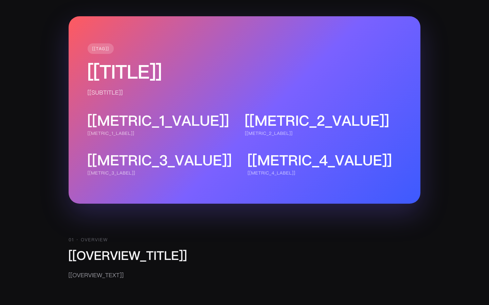
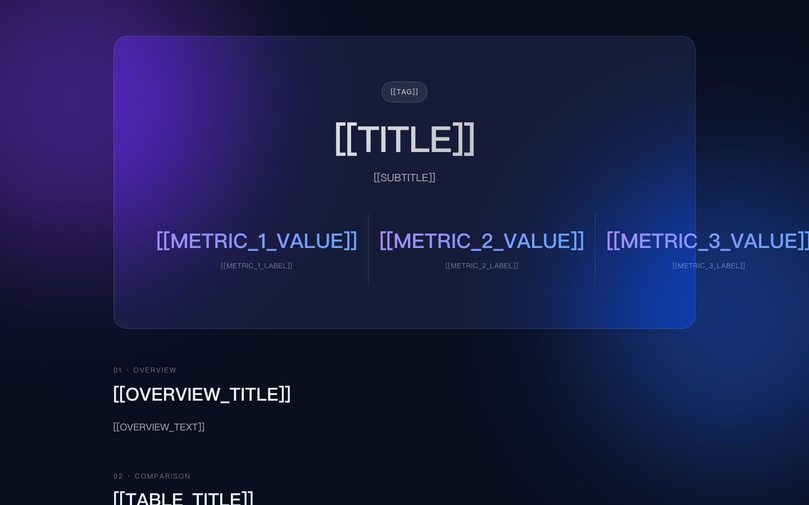
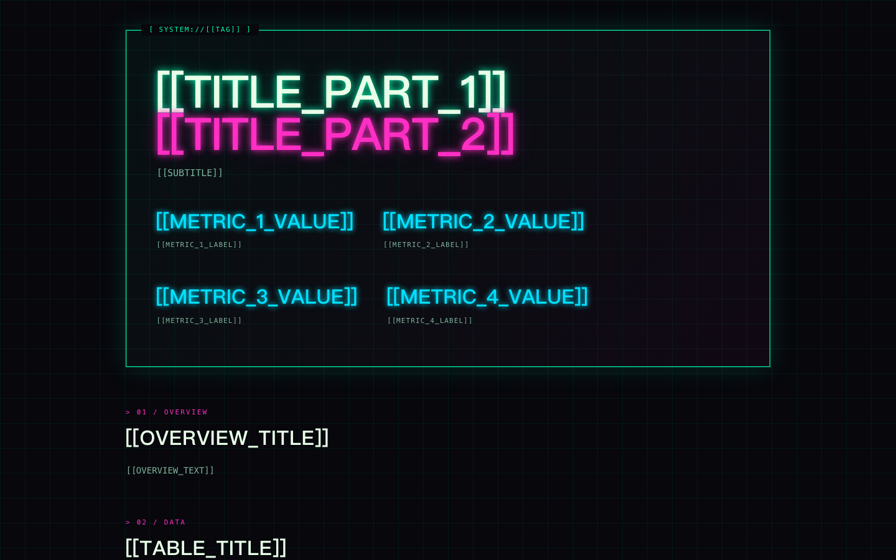
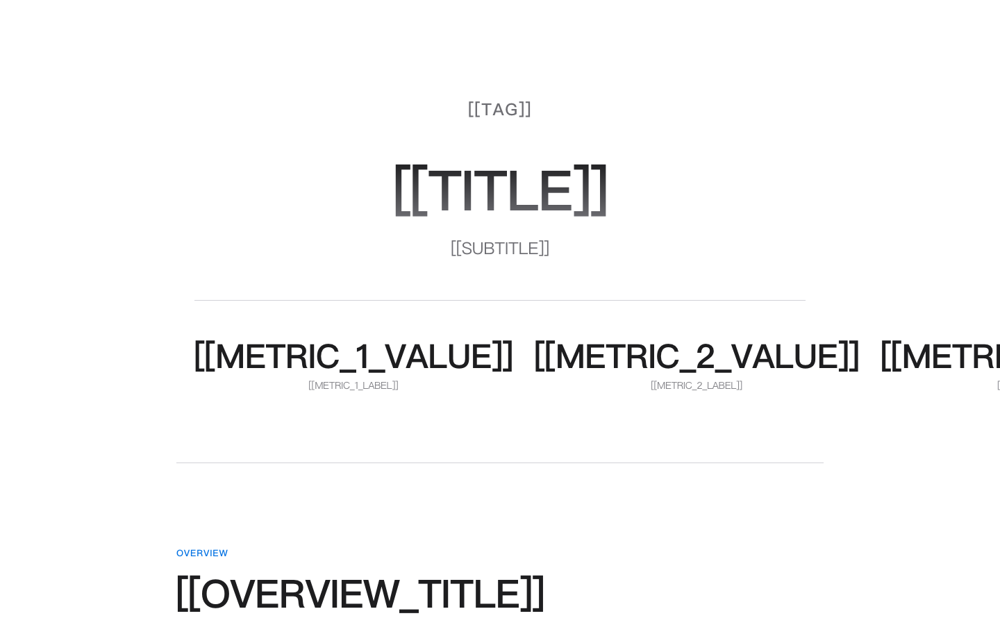
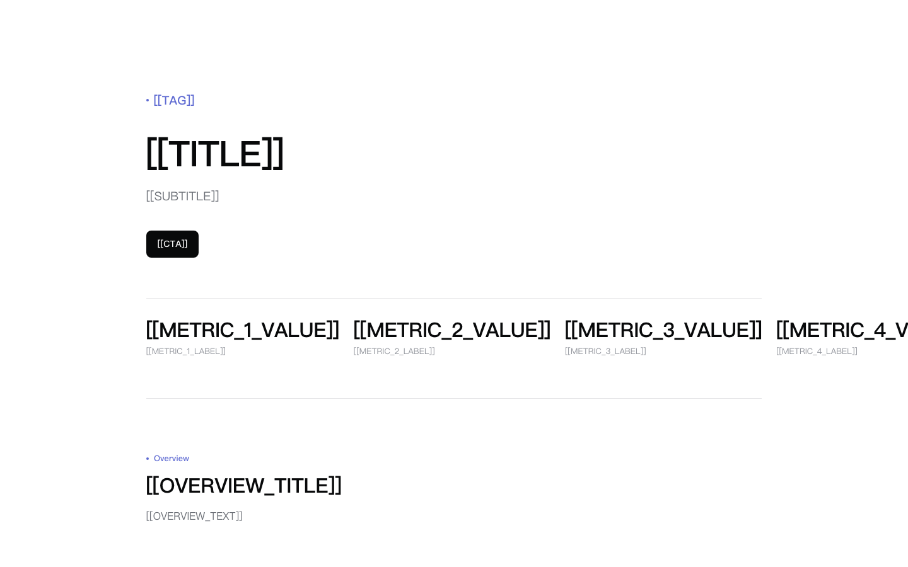
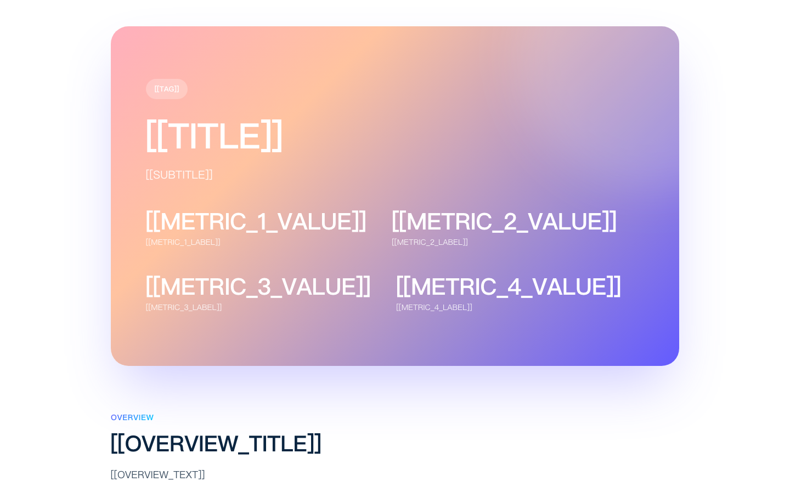
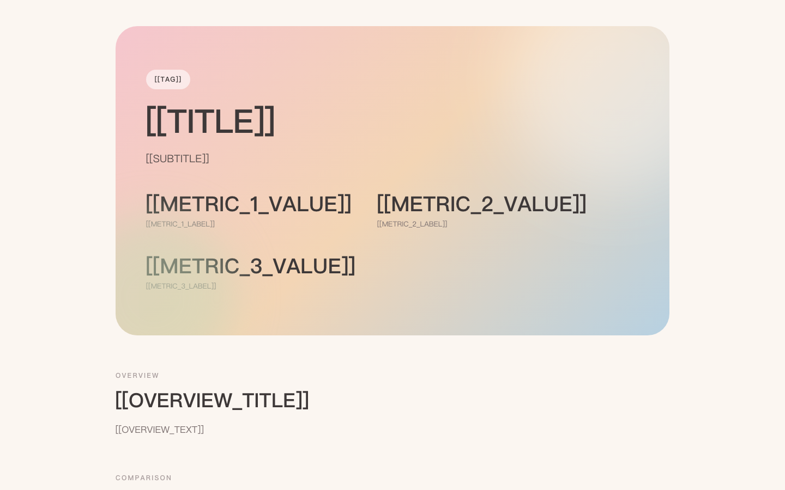
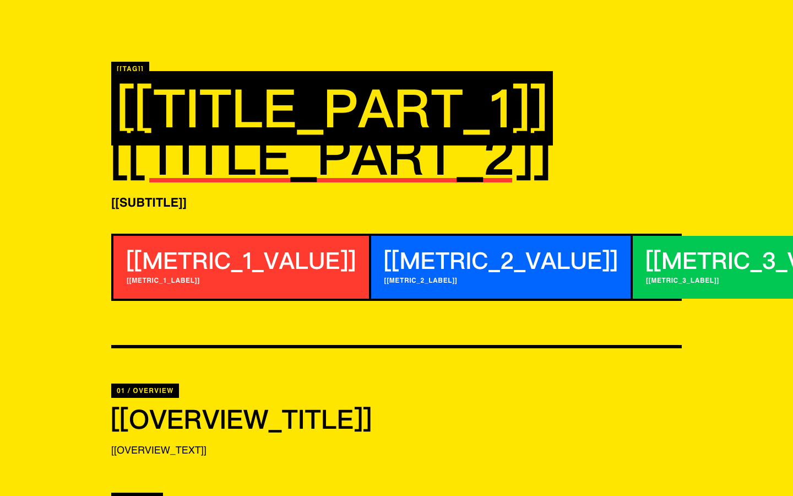
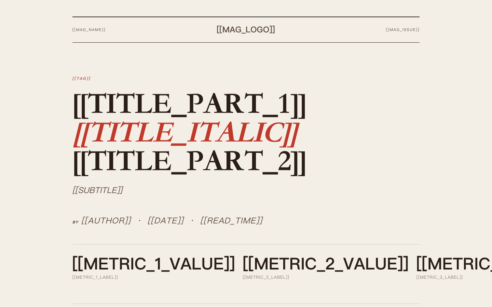
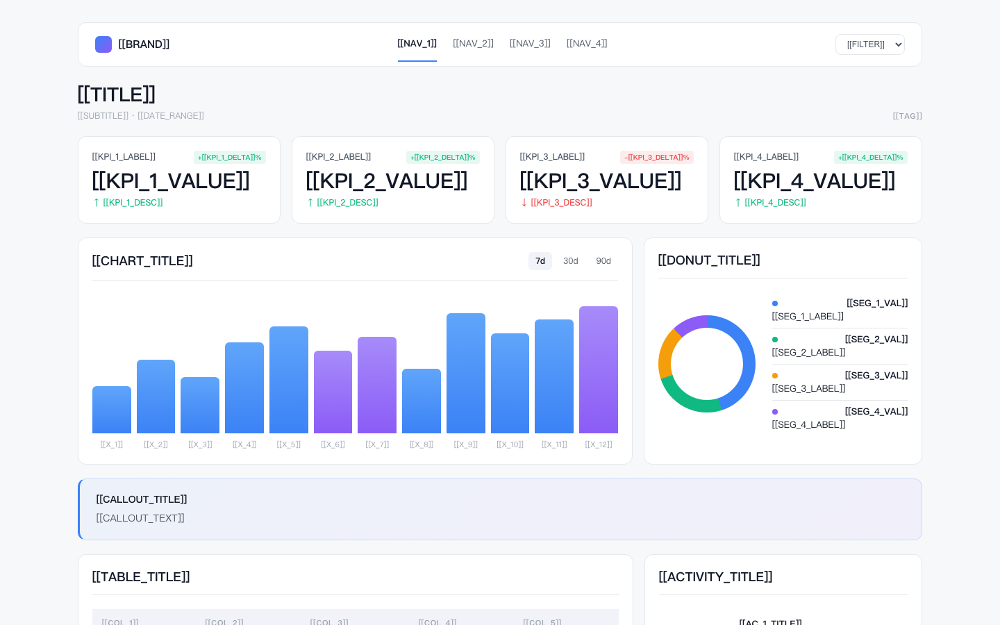

# 10 Dribbble Vibes

> 10 套高审美单文件 HTML 模板。换内容即出页面，丢给 AI Agent 一键采用配色与布局。

灵感源自 Dribbble、Awwwards、Linear、Vercel、Stripe、Apple、The New Yorker 等顶级产品与刊物。每套模板都是 **单文件 HTML + 内联 CSS，零依赖、零 JS**，包含 8 个标准模块（Hero / Overview / Table / Card Grid / Detail / Timeline / Quote / Footer）。

---

## 设计原则

- **单文件可移植**：每套都是一个完整 `template.html`，直接双击就能在浏览器打开
- **Token 驱动**：所有颜色、字号、圆角、阴影都集中在 `:root` CSS 变量里，改主题只动一处
- **占位符替换**：用 `[[TITLE]]` `[[ROW_1_C1]]` 这样的标记标出可替换内容，AI 或人工换文都不会破坏样式
- **不混搭**：要换风格就整套换，避免风格不统一
- **不引入框架**：不用 Tailwind / Bootstrap / 任何 JS 库，纯手写 CSS

---

## 10 套风格

| # | 名称 | 氛围 | 主色 | 适合 |
|---|------|------|------|------|
| 01 | **Dribbble Dark** | 潮流、活力、年轻 | `#FF5A5F → #7B61FF → #3D5AFE` | 活动报告、出行 / 旅行报告 |
| 02 | **Glassmorphism Dark** | 科技、未来、轻盈 | `#0E1530` + 紫蓝光晕 | 产品 Landing、SaaS |
| 03 | **Cyberpunk Neon** | 极客、赛博、强烈 | `#00FFB2` `#FF2EC4` on `#07070C` | 技术 demo、Hack 项目 |
| 04 | **Apple Editorial** | 克制、叙事、高级 | `#000` / `#FFF` / `#86868B` | 个人介绍、产品故事 |
| 05 | **Linear Minimal** | 极简、专业、利落 | `#FFF` + `#5E6AD2` | SaaS 主页、作品集、文档 |
| 06 | **Stripe Editorial** | 友好、明亮、商业 | 粉橘紫渐变 + 大圆角 | 金融科技、SaaS Landing |
| 07 | **Pastel Soft** | 温柔、生活、舒缓 | 藕粉 / 雾蓝 / 奶油 | 生活博客、播客、咖啡店 |
| 08 | **Brutalism** | 反叛、强烈、个性 | 黄 / 红 / 蓝高饱和 + 黑粗框 | 个性博客、艺术家个站 |
| 09 | **Magazine Editorial** | 复古、深度、阅读 | 米色 + 衬线大标题 | 专题报道、采访、深度文章 |
| 10 | **Dashboard Analytics** | 数据、专业、清晰 | `#F7F8FA` + 蓝 / 绿 / 紫 | 月报年报、数据看板 |

---

## 截图预览

| 01 Dribbble Dark | 02 Glassmorphism Dark |
|---|---|
|  |  |

| 03 Cyberpunk Neon | 04 Apple Editorial |
|---|---|
|  |  |

| 05 Linear Minimal | 06 Stripe Editorial |
|---|---|
|  |  |

| 07 Pastel Soft | 08 Brutalism |
|---|---|
|  |  |

| 09 Magazine Editorial | 10 Dashboard Analytics |
|---|---|
|  |  |

---

## 怎么用

### 给 AI Agent 用（推荐）

把整个仓库 clone 到本地，然后告诉任意 AI 编程 Agent（Cursor / Claude / Copilot 等）：

```
请按 10-dribbble-vibes/AGENT.md 的规则，
用风格 5（Linear Minimal）做一个 [你的内容主题] 页面，
保留所有 CSS 与布局，只替换占位符内容。
```

Agent 会读取 [`AGENT.md`](./AGENT.md) 里的规则：直接复制对应 `templates/{编号}/template.html`，只替换 `[[XXX]]` 占位符，不动任何样式。

### 自己用

```bash
git clone https://github.com/itschriszhao/10-dribbble-vibes.git
cd 10-dribbble-vibes

# 浏览器看全部 10 套
open templates/*/template.html

# 选一套复制出来用
cp templates/05-linear-minimal/template.html my-page.html
# 把 [[TITLE]] [[SUBTITLE]] [[ROW_1_C1]] ... 替换成你的内容
open my-page.html
```

### 选哪套？

- **写报告 / 数据展示** → 01 Dribbble Dark / 10 Dashboard
- **个人作品集 / 介绍** → 04 Apple / 05 Linear
- **产品 Landing** → 02 Glassmorphism / 06 Stripe
- **想要个性 / 反差** → 03 Cyberpunk / 08 Brutalism
- **长文 / 深度阅读** → 09 Magazine
- **生活方式 / 温柔感** → 07 Pastel

---

## 占位符约定

每个 `template.html` 用 `[[XXX]]` 形式标记需替换的内容：

- `[[TITLE]]` `[[SUBTITLE]]` `[[TAG]]` — Hero 文案
- `[[METRIC_1_VALUE]]` `[[METRIC_1_LABEL]]` — Hero 数据 ×4
- `[[OVERVIEW_TITLE]]` `[[OVERVIEW_TEXT]]` — 概览段
- `[[COL_1..5]]` `[[ROW_N_C1..5]]` — 对比表
- `[[CARD_1_TITLE]]` `[[CARD_1_TEXT]]` — 卡片 ×3
- `[[DETAIL_TITLE]]` `[[DETAIL_TEXT]]` — 详情段
- `[[TL_1_TIME]]` `[[TL_1_TITLE]]` `[[TL_1_TEXT]]` — 时间线
- `[[QUOTE]]` `[[QUOTE_AUTHOR]]` — 引言
- `[[FOOTER_LEFT]]` `[[FOOTER_RIGHT]]` — 页脚

---

## 目录结构

```
10-dribbble-vibes/
├── README.md             # 本文档
├── AGENT.md              # 给 AI Agent 的一键采用指引
├── INDEX.md              # 10 套风格速查
├── LICENSE
├── screenshots/          # 10 张预览图
└── templates/
    ├── 01-dribbble-dark/
    │   ├── template.html # 完整可运行 HTML
    │   └── tokens.md     # 配色 / 字体 / 间距速查
    ├── 02-glassmorphism-dark/
    ├── 03-cyberpunk-neon/
    ├── 04-apple-editorial/
    ├── 05-linear-minimal/
    ├── 06-stripe-editorial/
    ├── 07-pastel-soft/
    ├── 08-brutalism/
    ├── 09-magazine-editorial/
    └── 10-dashboard-analytics/
```

每个 `tokens.md` 包含完整设计变量：配色（HEX）、字体栈、字号阶梯、间距 / 圆角 / 阴影、关键 CSS 片段（渐变、毛玻璃、霓虹发光等）。

---

## 灵感来源

| 风格 | 借鉴对象 |
|------|---------|
| Dribbble Dark | Dribbble dark gradient hero shots、Linear changelog |
| Glassmorphism Dark | Apple Vision Pro 官网、Arc browser |
| Cyberpunk Neon | t3.chat、Vercel Edge demos、Cyberpunk 2077 UI |
| Apple Editorial | apple.com 产品页、Things 3 |
| Linear Minimal | linear.app、vercel.com、railway.app |
| Stripe Editorial | stripe.com、resend.com |
| Pastel Soft | Notion personal、Are.na、独立播客站 |
| Brutalism | Figma 早期、Gumroad、Awwwards 获奖站 |
| Magazine Editorial | NYT cooking、The New Yorker、Pitchfork Reviews |
| Dashboard Analytics | Linear Insights、Vercel Analytics、Posthog |

致敬：[Dribbble](https://dribbble.com)、[Awwwards](https://www.awwwards.com)、[SiteInspire](https://www.siteinspire.com)。

---

## License

MIT — 见 [LICENSE](./LICENSE)。随便用、改、商用都行，保留版权声明即可。

如果有用，欢迎 star ⭐
